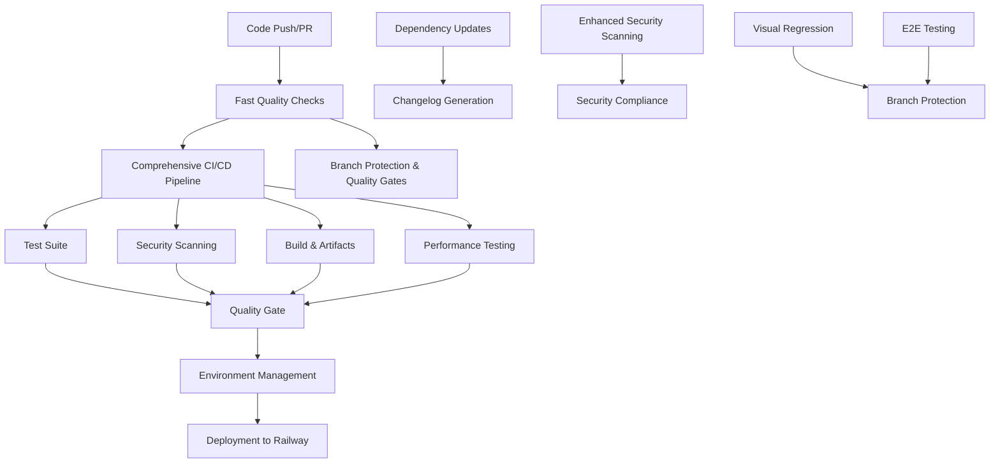

# Comprehensive GitHub Actions Workflow Documentation

## Overview

This document provides comprehensive documentation for all GitHub Actions workflows implemented for the Crazy-Gary project. These workflows provide a complete CI/CD pipeline with automated testing, security scanning, deployment, and quality assurance.

## Workflow Architecture

### Core Principles

- **Multi-stage Pipeline**: Each workflow is designed to be modular and reusable
- **Security First**: Security scanning and validation at every stage
- **Quality Gates**: Automated quality checks prevent poor code from reaching production
- **Environment Management**: Proper separation and management of development, staging, and production environments
- **Automation**: Minimal manual intervention required for routine operations

### Workflow Dependencies



## Workflows

### 1. Comprehensive CI/CD Pipeline (`comprehensive-ci-cd.yml`)

**Purpose**: Main CI/CD pipeline that orchestrates the entire development lifecycle.

**Triggers**:
- Push to `main`, `develop`, `release/*`, `hotfix/*`
- Pull requests to `main`, `develop`
- Schedule (daily security scans)
- Manual dispatch with environment selection

**Jobs**:

#### Fast Quality Gates
- **Purpose**: Quick validation of code quality
- **Duration**: ~10 minutes
- **Checks**: Type checking, linting, format validation, basic security audit
- **Output**: Cache key for subsequent jobs

#### Test Suite
- **Purpose**: Comprehensive testing across all components
- **Duration**: ~45 minutes
- **Components**:
  - Frontend unit and integration tests
  - Backend unit and integration tests  
  - API integration tests
  - E2E tests with Playwright
  - Accessibility tests
- **Outputs**: Test results, coverage reports

#### Security Scan
- **Purpose**: Comprehensive security analysis
- **Duration**: ~30 minutes
- **Scans**:
  - NPM audit for vulnerabilities
  - Python safety checks
  - Semgrep SAST analysis
  - License compliance
- **Output**: Security score, vulnerability reports

#### Build and Artifacts
- **Purpose**: Build all applications and create deployment packages
- **Duration**: ~20 minutes
- **Activities**:
  - Build frontend and backend applications
  - Bundle size analysis
  - Create deployment packages
  - Generate build metadata
- **Output**: Build artifacts, deployment packages

#### Performance Testing
- **Purpose**: Ensure application performance meets standards
- **Duration**: ~30 minutes
- **Tests**:
  - Lighthouse CI performance analysis
  - Bundle analysis
  - Performance metrics collection
- **Output**: Performance scores, optimization reports

#### Railway Deployment
- **Purpose**: Deploy to Railway with environment management
- **Duration**: ~15 minutes
- **Environments**: Development, staging, production
- **Features**:
  - Environment-specific configuration
  - Health checks
  - Deployment validation
- **Output**: Deployment URLs, environment status

#### Quality Gate
- **Purpose**: Final quality validation before deployment
- **Duration**: ~2 minutes
- **Criteria**:
  - All tests passed (40 points)
  - Security scan passed (30 points)
  - Build successful (20 points)
  - Performance tests passed (10 points)
- **Threshold**: 80% minimum score

### 2. Dependency Updates (`dependency-updates.yml`)

**Purpose**: Automated dependency management and security updates.

**Triggers**:
- Schedule (weekly on Mondays)
- Manual dispatch with update type selection

**Jobs**:

#### Dependency Audit
- **Purpose**: Analyze current dependency security status
- **Duration**: ~15 minutes
- **Audits**:
  - NPM audit for vulnerabilities
  - Yarn audit for workspace dependencies
  - Python security audit with pip-audit
- **Output**: Comprehensive audit reports

#### Security Updates
- **Purpose**: Update dependencies with security fixes
- **Duration**: ~20 minutes
- **Actions**:
  - Update npm packages with security patches
  - Update Python packages with vulnerability fixes
  - Test updates don't break functionality
- **Output**: Security update PR

#### Minor Updates
- **Purpose**: Update minor versions of dependencies
- **Duration**: ~25 minutes
- **Actions**:
  - Update npm packages (minor versions only)
  - Update Python packages (minor versions only)
  - Run comprehensive tests
- **Output**: Minor update PR

#### Comprehensive Updates
- **Purpose**: Update all dependencies including major versions
- **Duration**: ~45 minutes
- **Actions**:
  - Update all npm and Python dependencies
  - Generate detailed change report
  - Run full test suite
  - Create comprehensive update PR
- **Output**: Comprehensive update PR with detailed report

#### Dependency Monitoring
- **Purpose**: Ongoing monitoring and reporting
- **Duration**: ~10 minutes
- **Features**:
  - Generate monitoring reports
  - Create issues for critical vulnerabilities
  - Trend analysis
- **Output**: Monitoring reports, alerts

### 3. Changelog Generation (`changelog-generation.yml`)

**Purpose**: Automated changelog generation based on conventional commits.

**Triggers**:
- Push to `main`, `develop`
- Release publication
- Manual dispatch with changelog type selection

**Jobs**:

#### Changelog Analysis
- **Purpose**: Analyze commit history for changelog generation
- **Duration**: ~10 minutes
- **Analysis**:
  - Extract version tags
  - Analyze commit types (feat, fix, docs, etc.)
  - Identify breaking changes
- **Output**: Commit range, change types, contributor list

#### Conventional Commits Analysis
- **Purpose**: Validate and process conventional commits
- **Duration**: ~15 minutes
- **Features**:
  - Generate changelog using conventional-changelog
  - Extract breaking changes
  - Analyze commit message compliance
- **Output**: Changelog content, breaking changes, contributors

#### Changelog Enhancement
- **Purpose**: Enhance changelog with additional metadata
- **Duration**: ~10 minutes
- **Enhancements**:
  - Version bump determination
  - Enhanced formatting
  - Statistics and metrics
  - Contributor acknowledgments
- **Output**: Enhanced changelog, version bump recommendation

#### Release Preparation
- **Purpose**: Prepare for release with version management
- **Duration**: ~10 minutes
- **Features**:
  - Generate release version
  - Create release notes
  - Prepare release artifacts
- **Output**: Release notes, version tags

#### Changelog Validation
- **Purpose**: Validate generated changelog
- **Duration**: ~5 minutes
- **Validation**:
  - Format compliance check
  - Conventional commits validation
  - Generate validation report
- **Output**: Validation results, issues for breaking changes

### 4. Enhanced Security Scanning (`enhanced-security-scanning.yml`)

**Purpose**: Comprehensive security analysis and vulnerability assessment.

**Triggers**:
- Push to `main`, `develop`
- Pull requests
- Schedule (daily at 4 AM UTC)
- Manual dispatch with scan type selection

**Jobs**:

#### Secret Scanning
- **Purpose**: Detect hardcoded secrets and credentials
- **Duration**: ~15 minutes
- **Tools**:
  - TruffleHog for comprehensive secret detection
  - GitLeaks for pattern-based scanning
- **Output**: Secret detection report, scan status

#### Dependency Vulnerability Scanning
- **Purpose**: Scan dependencies for known vulnerabilities
- **Duration**: ~20 minutes
- **Scans**:
  - NPM audit with detailed severity breakdown
  - Python security audit with safety and bandit
  - License compliance check
- **Output**: Vulnerability counts, security scores

#### Static Application Security Testing (SAST)
- **Purpose**: Analyze source code for security issues
- **Duration**: ~25 minutes
- **Tools**:
  - Semgrep for rule-based analysis
  - CodeQL for deep semantic analysis
  - Custom security pattern checks
- **Output**: SAST findings, security scores

#### Dynamic Application Security Testing (DAST)
- **Purpose**: Test running application for security vulnerabilities
- **Duration**: ~30 minutes
- **Tests**:
  - OWASP ZAP baseline scan
  - Security headers analysis
  - Runtime security assessment
- **Output**: DAST findings, security scores

#### Security Compliance
- **Purpose**: Overall security compliance assessment
- **Duration**: ~5 minutes
- **Features**:
  - Calculate overall security score
  - Determine compliance status
  - Generate comprehensive report
- **Output**: Security compliance score, status, critical issues

### 5. Environment Management (`environment-management.yml`)

**Purpose**: Manage deployment environments and operations.

**Triggers**:
- Push to specific branches
- Manual dispatch with environment and action selection

**Jobs**:

#### Environment Validation
- **Purpose**: Validate environment parameters and configuration
- **Duration**: ~5 minutes
- **Validation**:
  - Environment parameter validation
  - Environment-specific configuration generation
  - Branch-to-environment mapping
- **Output**: Validated environment, configuration JSON

#### Deploy Environment
- **Purpose**: Deploy application to specified environment
- **Duration**: ~15 minutes
- **Features**:
  - Environment-specific deployment
  - Permission validation
  - Health checks
  - Deployment validation
- **Output**: Deployment URL, deployment status

#### Scale Environment
- **Purpose**: Scale application resources
- **Duration**: ~10 minutes
- **Actions**:
  - Adjust instance counts
  - Modify CPU/memory allocation
  - Apply scaling policies
- **Output**: Scaling confirmation

#### Rollback Environment
- **Purpose**: Rollback to previous deployment
- **Duration**: ~10 minutes
- **Features**:
  - Find target deployment
  - Perform rollback
  - Validate rollback success
- **Output**: Rollback status, previous version

#### Backup and Restore
- **Purpose**: Backup and restore environment data
- **Duration**: ~15 minutes
- **Operations**:
  - Export environment variables
  - Database backup (production only)
  - Restore from backup
- **Output**: Backup confirmation, restore status

#### Environment Monitoring
- **Purpose**: Monitor environment health and performance
- **Duration**: ~5 minutes
- **Monitoring**:
  - Health status checks
  - Performance metrics
  - Alert generation
- **Output**: Monitoring report, alerts

### 6. Branch Protection and Quality Gates (`branch-protection.yml`)

**Purpose**: Ensure code quality through branch protection and quality validation.

**Triggers**:
- Pull requests to `main`, `develop`
- Push to `main`, `develop`
- Manual dispatch with branch protection action

**Jobs**:

#### Branch Protection Status
- **Purpose**: Check current branch protection configuration
- **Duration**: ~10 minutes
- **Checks**:
  - Main branch protection status
  - Develop branch protection status
  - Current protection rules
- **Output**: Protection status, current rules

#### Update Branch Protection
- **Purpose**: Configure or update branch protection rules
- **Duration**: ~15 minutes
- **Configuration**:
  - Main branch: 2 approvals, code owner review required
  - Develop branch: 1 approval, relaxed rules
  - Required status checks configuration
- **Output**: Protection rules configured

#### Quality Gate Validation
- **Purpose**: Validate PR quality before merging
- **Duration**: ~10 minutes
- **Validation**:
  - Commit message format validation
  - PR requirements check
  - Code owner review validation
  - Quality score calculation
- **Output**: Quality score, gate status

#### Status Check Orchestration
- **Purpose**: Coordinate status checks for PRs
- **Duration**: ~5 minutes
- **Orchestration**:
  - Required checks for each branch
  - PR status updates
  - Documentation generation
- **Output**: Status check configuration

#### Notification
- **Purpose**: Notify team of branch protection status
- **Duration**: ~5 minutes
- **Notifications**:
  - Protection status summary
  - Quality gate results
  - Issue creation for unprotected branches
- **Output**: Notifications sent

## Existing Workflows

The following workflows already exist and are integrated into the comprehensive pipeline:

### 1. CI/CD Pipeline (`ci.yml`)
- Basic quality checks, testing, security, and performance
- Integrated into comprehensive pipeline

### 2. CodeQL Analysis (`codeql.yml`)
- Advanced static analysis
- Integrated into security scanning workflow

### 3. Visual Regression Tests (`visual-regression.yml`)
- Comprehensive visual testing across browsers and devices
- Standalone workflow with baseline updates

### 4. E2E Testing (`e2e-tests.yml`, `comprehensive-e2e-testing.yml`)
- End-to-end testing with Playwright
- Integrated into comprehensive test suite

### 5. Railway Validation (`railway-validate.yml`)
- Railway configuration validation
- Pre-deployment check in environment management

### 6. Roadmap Management (`roadmap-management.yml`)
- Project management automation
- Standalone workflow

### 7. Label Synchronization (`sync-labels.yml`)
- GitHub label management
- Standalone workflow

## Configuration

### Environment Variables

Required secrets and environment variables:

```bash
# GitHub Token (automatically available)
GITHUB_TOKEN

# Railway Configuration
RAILWAY_TOKEN=your_railway_token
RAILWAY_PROJECT_ID=your_project_id

# Security Tools (optional)
ZAP_API_KEY=your_zap_api_key

# Notification Webhooks (optional)
SLACK_WEBHOOK_URL=your_slack_webhook
DISCORD_WEBHOOK_URL=your_discord_webhook
```

### Branch Protection Rules

The workflow automatically configures branch protection:

**Main Branch (`main`)**:
- Required status checks: comprehensive-ci-cd, enhanced-security-scanning, changelog-generation
- Required approving reviews: 2
- Dismiss stale reviews: Enabled
- Require code owner reviews: Enabled
- Enforce for admins: Enabled

**Develop Branch (`develop`)**:
- Required status checks: comprehensive-ci-cd, enhanced-security-scanning
- Required approving reviews: 1
- Dismiss stale reviews: Disabled
- Require code owner reviews: Disabled
- Enforce for admins: Disabled

### Quality Gate Thresholds

- **Minimum Quality Score**: 70/100
- **Security Score Threshold**: 80/100
- **Performance Score Threshold**: 70/100
- **Test Coverage Threshold**: 80%

## Usage

### Manual Workflow Triggers

#### Comprehensive CI/CD Pipeline
```yaml
workflow_dispatch:
  inputs:
    environment:
      description: 'Target environment'
      required: true
      type: choice
      options: [staging, production]
    force_deploy:
      description: 'Force deployment even if tests fail'
      required: false
      type: boolean
```

#### Dependency Updates
```yaml
workflow_dispatch:
  inputs:
    update_type:
      description: 'Type of updates to perform'
      type: choice
      options: [security, minor, all]
    dry_run:
      description: 'Perform a dry run'
      type: boolean
      default: true
```

#### Environment Management
```yaml
workflow_dispatch:
  inputs:
    environment:
      description: 'Target environment'
      type: choice
      options: [development, staging, production, preview]
    action:
      description: 'Action to perform'
      type: choice
      options: [deploy, rollback, scale, restart, backup, restore]
    version:
      description: 'Version to deploy (for rollback/restore)'
      type: string
```

#### Enhanced Security Scanning
```yaml
workflow_dispatch:
  inputs:
    scan_type:
      description: 'Type of security scan'
      type: choice
      options: [comprehensive, dependency, static-analysis, dynamic-analysis, secret-scanning]
    severity_threshold:
      description: 'Minimum severity to report'
      type: choice
      options: [critical, high, medium, low]
    fail_on_severity:
      description: 'Fail workflow on findings above threshold'
      type: choice
      options: [critical, high, medium, none]
```

#### Branch Protection
```yaml
workflow_dispatch:
  inputs:
    branch:
      description: 'Branch to protect'
      type: string
    action:
      description: 'Action to perform'
      type: choice
      options: [protect, unprotect, update-rules, status-check]
```

## Monitoring and Alerting

### Workflow Status Monitoring

All workflows provide detailed status summaries in GitHub step summaries:

- **Quality Scores**: Overall pipeline quality assessment
- **Security Scores**: Security compliance ratings
- **Performance Metrics**: Application performance tracking
- **Deployment Status**: Environment deployment health

### Alert Generation

The workflows automatically generate alerts for:

- **Critical Security Issues**: Immediate notification for security vulnerabilities
- **Quality Gate Failures**: Notification when code doesn't meet quality standards
- **Deployment Failures**: Alert when deployments fail or health checks fail
- **Dependency Vulnerabilities**: Weekly reports on dependency security status

### Integration Points

#### Notification Systems
- **Slack**: Webhook integration for team notifications
- **Discord**: Webhook integration for developer community
- **Email**: Can be configured through GitHub Actions marketplace actions

#### Monitoring Tools
- **Sentry**: Error tracking and performance monitoring
- **DataDog**: Application performance monitoring
- **New Relic**: Full-stack observability

## Best Practices

### Commit Message Format

Follow conventional commits for automatic changelog generation:

```
<type>(<scope>): <description>

[optional body]

[optional footer(s)]
```

**Types**:
- `feat`: New feature
- `fix`: Bug fix
- `docs`: Documentation changes
- `style`: Code style changes (formatting, etc.)
- `refactor`: Code refactoring
- `test`: Adding or updating tests
- `chore`: Maintenance tasks

**Examples**:
```
feat(api): add user authentication endpoint
fix(frontend): resolve mobile layout issue
docs(readme): update installation instructions
```

### Pull Request Guidelines

1. **Clear Description**: Explain what and why
2. **Link Issues**: Connect PRs to relevant issues
3. **Keep Focused**: One feature/fix per PR
4. **Reasonable Size**: Aim for < 20 changed files
5. **Tests Included**: Add tests for new features
6. **Documentation**: Update docs for breaking changes

### Security Best Practices

1. **No Hardcoded Secrets**: Use environment variables
2. **Dependency Updates**: Regular security updates
3. **Security Scanning**: Address findings promptly
4. **Code Reviews**: Mandatory for main branch
5. **Access Control**: Principle of least privilege

### Performance Optimization

1. **Caching**: Automated dependency and build caching
2. **Parallel Execution**: Jobs run in parallel where possible
3. **Resource Management**: Appropriate runner selection
4. **Artifact Management**: Efficient artifact storage and cleanup
5. **Failure Fast**: Early detection of critical issues

## Troubleshooting

### Common Issues

#### Quality Gate Failures
- **Low Test Coverage**: Add tests to improve coverage
- **Security Issues**: Update dependencies, fix vulnerabilities
- **Performance Issues**: Optimize code, reduce bundle size
- **Code Style**: Fix linting and formatting issues

#### Security Scan Failures
- **Vulnerability Findings**: Update affected dependencies
- **Secret Detection**: Remove hardcoded credentials
- **License Issues**: Review license compatibility
- **SAST Findings**: Fix code security issues

#### Deployment Issues
- **Build Failures**: Check build configuration and dependencies
- **Health Check Failures**: Verify application startup and dependencies
- **Environment Issues**: Check environment variable configuration
- **Railway Issues**: Verify Railway configuration and permissions

### Debug Mode

Enable debug logging by setting:
```yaml
env:
  ACTIONS_STEP_DEBUG: true
  ACTIONS_RUNNER_DEBUG: true
```

### Workflow Logs

Access detailed logs in:
- GitHub Actions tab
- Individual job logs
- Step-level debugging information

### Recovery Procedures

#### Rollback Process
1. Use Environment Management workflow with `rollback` action
2. Specify target version or use automatic previous version
3. Validate rollback success
4. Monitor application health

#### Emergency Deployment
1. Use manual workflow dispatch with `force_deploy: true`
2. Bypass quality gates for critical fixes
3. Monitor deployment closely
4. Follow up with proper PR and review process

## Maintenance

### Regular Tasks

1. **Weekly**: Review dependency updates and security reports
2. **Monthly**: Update workflow versions and dependencies
3. **Quarterly**: Review and optimize workflow performance
4. **Annually**: Comprehensive security audit and workflow review

### Workflow Updates

When updating workflows:

1. Test changes in a fork or feature branch
2. Review breaking changes and updates
3. Update documentation
4. Communicate changes to the team
5. Monitor performance after deployment

### Performance Monitoring

Monitor workflow performance metrics:
- **Duration**: Track job execution times
- **Success Rate**: Monitor workflow success/failure rates
- **Resource Usage**: CPU and memory consumption
- **Queue Times**: Workflow startup delays

## Support

### Getting Help

1. **Documentation**: Check this documentation first
2. **GitHub Issues**: Create issues for workflow problems
3. **Team Support**: Reach out to DevOps team
4. **Community**: GitHub Actions community forums

### Contributing

To improve workflows:

1. Create feature branches from `develop`
2. Follow the existing code structure
3. Add comprehensive tests for new functionality
4. Update documentation
5. Submit pull requests for review

---

**Last Updated**: $(date -u)
**Version**: 1.0.0
**Maintainer**: DevOps Team