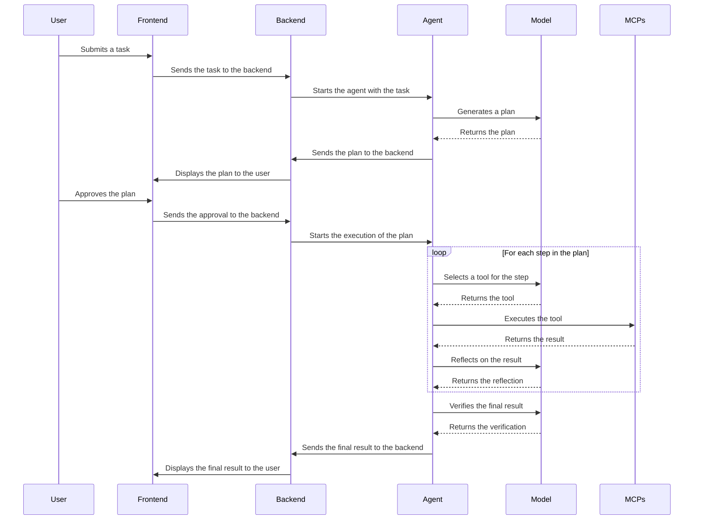
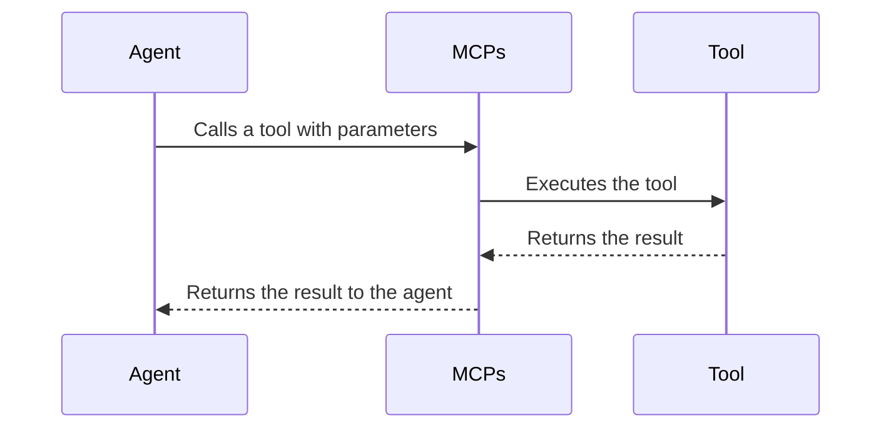
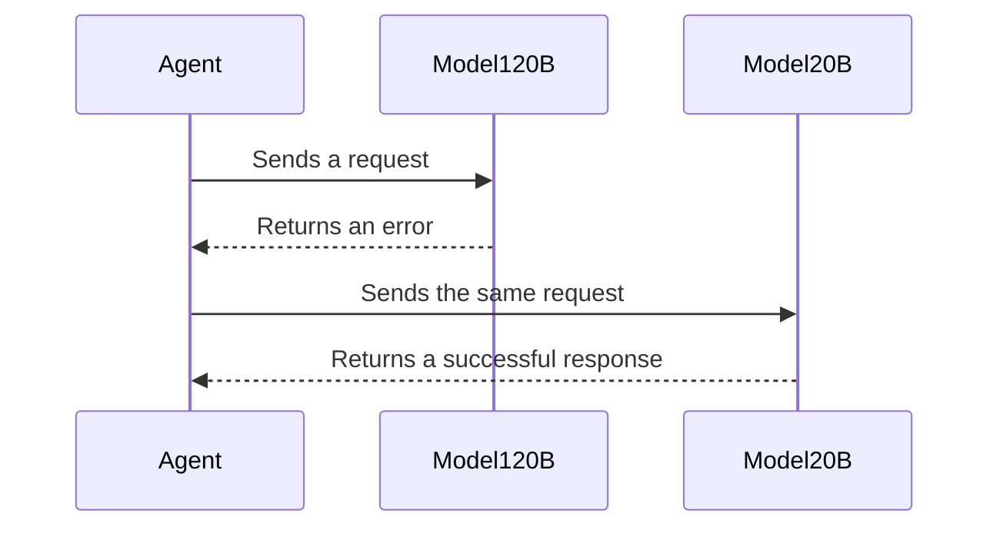
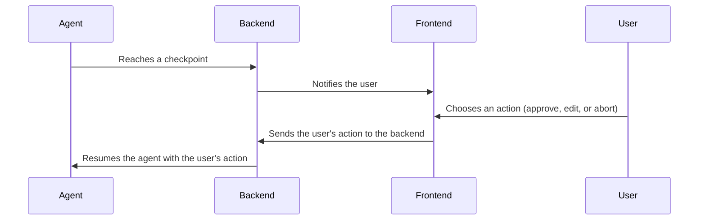

# Sequence Diagrams

This document contains sequence diagrams that illustrate the key workflows of the Crazy-Gary application.

## 1. Agent Loop

This diagram shows the main loop of the agent as it processes a task.

## 2. Tool Call

This diagram shows the process of calling a tool through an MCP.

## 3. Model Fallback

This diagram shows the process of falling back to the 20B model if the 120B model is unavailable.

## 4. Human Checkpoint

This diagram shows the process of a human checkpoint, where the user can approve, edit, or abort a task.

